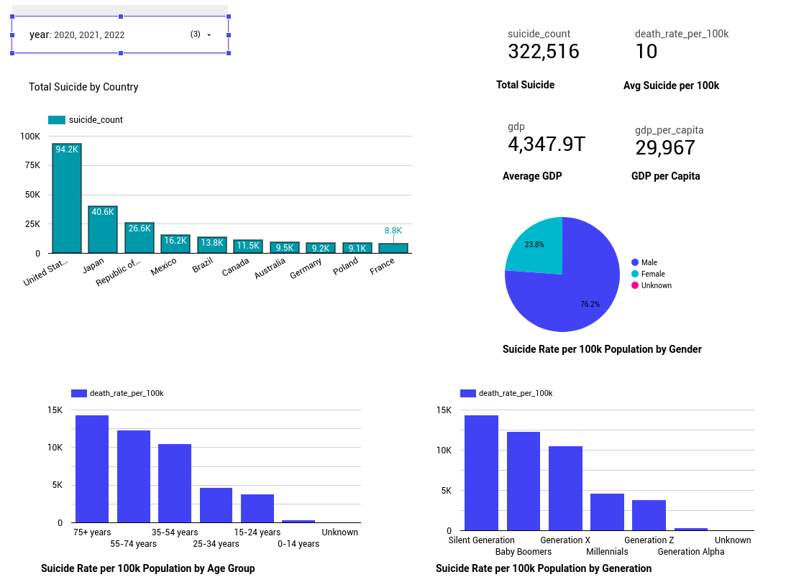

# DEGlobSuicide

Welcome to  This project focuses on exploring and analyzing ... . It is part of the Data Engineering Zoomcamp course and aims to provide insights into the  through data engineering and visualization techniques.

## Overview

The project involves extracting, loading, and transforming (ELT) this data into Google Cloud Platform (GCP), specifically storing it in Google Cloud Storage (GCS) and BigQuery. The workflow also includes data transformation using DBT (Data Build Tool) and visualization using Looker Studio.

## Dataset Information

The [dataset](https://data.open-power-system-data.org/renewable_power_plants/2020-08-25/renewable_power_plants_DE.csv) is sourced from the [OPSD](https://data.open-power-system-data.org/) website.

## Objective

The main objective of this project is to build an end-to-end data pipeline to process, analyze, and visualize the data of renewable power plants in Germany. This involves setting up data lakes, creating pipelines for importing, exporting, processing, and transforming data, integrating with data warehouses, and building interactive dashboards for visualization.

## File Structure

- **Data**: Directory to store the dataset downloaded from the OPSD website.
- **mage-globsuicide**: Contains Mage project.
- **mage-globsuicide/dbt/dbt_globsuicide**: Contains DBT Project.
- **terraform**: Terraform file for setting up GCP infrastructure.
- **reproduce**: Detailed documentation and scripts for reproducing the project and pipelines.

## Technologies Used

- **Programming Language**: Python (for data processing)
- **Cloud**: Google Cloud Platform (GCP)
- **Infrastructure as Code (IaC)**: Terraform
- **Workflow Orchestration**: Mage
- **Data Lake**: GCS (Google Cloud Storage)
- **Data Warehouse**: BigQuery
- **Data Transformation**: DBT (Data Build Tool)
- **Business Intelligence Tools**: Google Data Studio
- **Containerization**: Docker
- **Container Orchestration**: Docker Compose

## Project Components

1. **System and Infrastructure Setup**
2. **Data Ingestion and Loading into Data lake Pipeline**
3. **Loading Data into Data warehouse and Transforming Pipeline**
4. **Dashboard Development for Visualization**

## Workflow

1. **Infrastructure Setup**: The project starts with setting up the required infrastructure using Terraform IaC solution.
2. **Data Ingestion and Data Loading to GCS**: In this step, the project ingests the required data from the OPSD website, processes it, converts the CSV file to Parquet (Parquet format is used for efficient storage), and loads the Parquet formatted data into Google Cloud Storage (GCS) for storage and easy accessibility.
3. **Data Ingestion to BigQuery**: The data stored in GCS is then ingested into BigQuery for transformation. The data is organized into appropriate tables for efficient data processing.
4. **Data Transformation with DBT**: DBT (Data Build Tool) is utilized for data transformations and modeling. This step involves creating views, tables using data transformation techniques such as removing sparse data, cleaning and correcting data, and applying business logic to the data in BigQuery.
5. **Data Visualization with Looker Studio**: The transformed and modeled data in BigQuery is visualized using Looker Studio for insightful data analysis and reporting. Looker Studio connects directly to BigQuery for visualization purposes.

## Workflow Diagram

## Dashboard

A dashboard is created using Looker Studio, providing interactive visualizations and insights into the renewable energy power plants data. The dashboard allows users to explore various aspects of the data, including geographical distribution, renewable energy adoption through years, energy sources, capacity trends, and more. A live dashboard will be available [here](https://lookerstudio.google.com/s/gOR1R7FDw9g) for a period of time.

## How to Use

To use this project, the first step is to clone or fork this repository to your machine. Further and detailed information can be found [here](./reproduce/README.md).

## Conclusion

## License

This project is licensed under the [Apache License](./LICENSE).